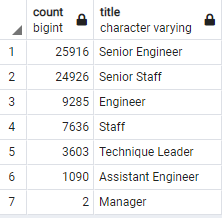
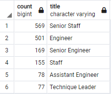

# **Employee Database Analysis**

## **Overview**

The purpose of the analysis is to determine the number of retiring employees per title and identify employees who are eligible to participate in a mentorship program, so that Pewlett Hackard can prepare for upcoming employee retirements.

## **Results**

The four major points from the two analysis deliverables are as follows:

* Current employees born between January 1, 1952 and December 31, 1955 are retiring.
* Retirements will affect seven titles.
* "Senior" titles (Senior Engineer or Senior Staff) will be most affected by retirements.
* Current employees born between January 1, 1965 and December 31, 1965 are eligible for the mentorship program.

*Retiring Titles:*

## **Summary**

### *How many roles will need to be filled as the "silver tsunami" begins to make an impact?*

Pewlett-Hackard will have 72,458 roles to fill as current employees born between 1952-1955 retire:
    
    SELECT SUM(count) as "Total Roles"
    FROM retiring_titles;
    
*Total Roles:*

Pewlett-Hackard could begin filling roles by promoting or transferring current qualified employees. This could be especially important for departments with many retirements in "Senior" titles, so that leadership does not suffer. Pewlett-Hackard should also begin recruiting and hiring "Engineer" titles at all levels since those roles will also be greatly affected by retirements.

### *Are there enough qualified, retirement-ready employees in the departments to mentor the next generation of Pewlett Hackard employees?*

There are not enough retirement-ready employees in the departments to mentor the next generation of Pewlett Hackard employees, should the company decide to fill all roles being vacated by retiring employees:

    SELECT COUNT(title), title
    FROM mentorship_eligibility
    GROUP BY title
    ORDER BY count DESC;

*Mentorship Eligibility Titles:*

Pewlett-Hackard should immediately consider expanding the age range eligibility for the mentorship program, or using total years of employment instead of age to determine eligibility. The current mentorship program will not meet the company's needs; the enormous disparity in retiring employees and mentorship-eligible employees may necessitate the establishment of an alternative mentorship or professional development program.
